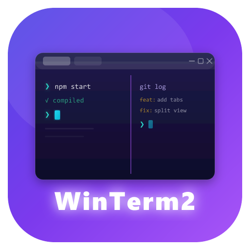

<p align="center">
  
</p>

<h1 align="center">WinTerm2</h1>

<p align="center">
  Windows 上的高级终端模拟器，灵感来自 macOS iTerm2
</p>

<p align="center">
  <a href="https://github.com/hailcanto/Winterm2/releases">下载最新版本</a>
</p>

---

## 简介

WinTerm2 是一款专为 Windows 打造的现代终端模拟器，借鉴了 macOS 上广受好评的 iTerm2 的设计理念。它提供多标签页、分屏、主题切换、搜索等功能，配合 WebGL 加速渲染和 ConPTY 支持，带来流畅且美观的终端体验。

### 亮点

- 多标签页 + 多层嵌套分屏
- 浮动面板（可拖拽移动、调整大小）
- 面板方向键导航 + 面板全屏
- 标签页双击重命名
- 同步输入（广播到同标签页所有面板）
- 命令面板（Ctrl+Shift+P 模糊搜索执行命令）
- 布局预设（双栏、三栏、田字格等一键应用）
- 会话保存与恢复（关闭后重开恢复布局）
- 文件路径/URL 点击打开
- 右键上下文菜单
- 6 套精心调配的内置主题
- WebGL GPU 加速渲染
- 完整的 256 色 + TrueColor 支持
- Unicode 11 / CJK / Emoji 正确显示
- iTerm2 图片协议支持
- 窗口透明度调节
- 底部状态栏（面板信息 + 快捷键提示）
- 搜索匹配计数显示
- 自动检测 PowerShell 7 / Windows PowerShell

---

## 下载安装

前往 [GitHub Releases](https://github.com/hailcanto/Winterm2/releases) 下载最新版本的安装包（`.exe`，NSIS 格式）。

> 系统要求：Windows 10 1903 及以上版本

下载后双击运行安装程序，按提示完成安装即可。

---

## 界面概览

启动后你会看到一个无边框窗口，从上到下依次是：

```
┌─────────────────────────────────────────┐
│  WinTerm2              ─  □  ✕         │ ← 标题栏（可拖拽移动窗口）
├─────────────────────────────────────────┤
│  终端  ×  │  终端  ×  │  +             │ ← 标签栏
├─────────────────────────────────────────┤
│                                         │
│  PS C:\Users\You>                       │ ← 终端区域
│                                         │
└─────────────────────────────────────────┘
```

- 标题栏右侧三个按钮：最小化（─）、最大化/还原（□/⧉）、关闭（✕）
- 标签栏显示所有打开的标签页，点击 `+` 新建标签

---

## 快捷键

### 标签页管理

| 快捷键 | 功能 |
|--------|------|
| `Ctrl+Shift+T` | 新建标签页 |
| `Ctrl+Shift+W` | 关闭当前标签页 |
| `Ctrl+Tab` | 切换到下一个标签 |
| `Ctrl+Shift+Tab` | 切换到上一个标签 |

### 分屏操作

| 快捷键 | 功能 |
|--------|------|
| `Alt+Shift+=` | 水平分屏（左右分割） |
| `Alt+Shift+-` | 垂直分屏（上下分割） |
| `Ctrl+Shift+X` | 关闭当前面板 |
| `Alt+←/→/↑/↓` | 方向键切换面板焦点 |
| `Alt+Shift+F` | 面板全屏/还原 |
| `Alt+Shift+N` | 新建浮动面板 |
| `Alt+F` | 显示/隐藏浮动面板 |
| `Alt+Shift+S` | 同步输入（广播到所有面板） |

分屏后可以拖拽分割线调整大小比例。点击面板即可将其设为活跃面板（蓝色边框高亮）。双击标签页名称可重命名。

```
┌──────────┬──────────┐     ┌──────────────────┐
│          │          │     │     终端 1        │
│  终端 1  │  终端 2  │     ├──────────────────┤
│          │          │     │     终端 2        │
└──────────┴──────────┘     └──────────────────┘
    水平分屏                      垂直分屏
```

支持多层嵌套分屏，例如先水平分屏，再对右侧面板垂直分屏：

```
┌──────────┬──────────┐
│          │  终端 2  │
│  终端 1  ├──────────┤
│          │  终端 3  │
└──────────┴──────────┘
```

### 终端操作

| 快捷键 | 功能 |
|--------|------|
| `Ctrl+Shift+C` | 复制选中文本 |
| `Ctrl+Shift+V` | 粘贴 |
| `Ctrl+Shift+F` | 打开/关闭搜索栏 |

### 字号与设置

| 快捷键 | 功能 |
|--------|------|
| `Ctrl+=` | 放大字号 |
| `Ctrl+-` | 缩小字号 |
| `Ctrl+0` | 重置字号（14px） |
| `Ctrl+,` | 打开/关闭设置面板 |
| `Ctrl+Shift+P` | 命令面板 |

---

## 搜索功能

按 `Ctrl+Shift+F` 打开搜索栏，搜索栏出现在终端区域右上角。

- 输入关键词后按 `Enter` 搜索下一个匹配
- `Shift+Enter` 搜索上一个匹配
- `Escape` 关闭搜索栏
- 搜索时显示匹配计数（如 "3/15"），无匹配时显示"无匹配"

搜索栏提供三个过滤选项（点击按钮切换，高亮表示启用）：

| 按钮 | 功能 |
|------|------|
| `.*` | 正则表达式模式 |
| `Aa` | 区分大小写 |
| `W` | 全词匹配 |

---

## 设置面板

按 `Ctrl+,` 打开设置面板（从右侧滑出），所有修改实时生效。

### 外观设置

| 选项 | 说明 | 默认值 |
|------|------|--------|
| 主题 | 选择内置主题 | One Dark |
| 字体 | 终端字体 | Cascadia Code, Consolas, monospace |
| 字号 | 字体大小（8-32） | 14 |
| 行高 | 行间距（1.0-2.0） | 1.2 |
| 光标样式 | 方块 / 下划线 / 竖线 | 竖线 |
| 光标闪烁 | 是否闪烁 | 开启 |
| 透明度 | 窗口透明度（0.5-1.0） | 1.0 |
| 分屏线颜色 | 分屏分割线颜色，支持预设和自定义 | #ff8c00 |
| 分屏线粗细 | 分屏分割线宽度（1-8px） | 4 |

### 终端设置

| 选项 | 说明 | 默认值 |
|------|------|--------|
| 默认 Shell | 终端使用的 Shell 程序 | 自动检测（优先 PowerShell 7） |
| 滚动缓冲区 | 可回滚的最大行数 | 5000 |
| 启动目录 | 新终端的工作目录 | 用户主目录 |

### 快捷键列表

设置面板底部展示所有快捷键绑定，方便查阅。

---

## 内置主题

WinTerm2 内置 6 套精心调配的主题，在设置面板中切换：

| 主题 | 风格 | 特点 |
|------|------|------|
| **One Dark** | 深色 | Atom 编辑器经典配色，柔和护眼 |
| **Dracula** | 深色 | 高对比度紫色系，色彩鲜明 |
| **Solarized Dark** | 深色 | Ethan Schoonover 经典方案，科学配色 |
| **Solarized Light** | 浅色 | Solarized 浅色版本，适合白天使用 |
| **Nord** | 深色 | 北极极光灵感，冷色调 |
| **Monokai** | 深色 | Sublime Text 经典配色，活力十足 |

切换主题后，标题栏、标签栏、终端区域、设置面板的颜色会同步更新。

---

## Shell 配置

WinTerm2 启动终端时会按以下优先级自动选择 Shell：

1. PowerShell 7（`pwsh.exe`）— 检查常见安装路径和 PATH
2. Windows PowerShell（`powershell.exe`）— 系统自带

你也可以在设置面板中手动指定 Shell 路径，例如：
- `C:\Program Files\Git\bin\bash.exe`（Git Bash）
- `wsl.exe`（WSL）
- `cmd.exe`（命令提示符）

---

## 技术特性

- **WebGL 加速渲染** — 默认使用 GPU 加速终端渲染，不支持时自动降级为 Canvas
- **ConPTY 支持** — 使用 Windows 10 1903+ 的 ConPTY API，完整支持 ANSI 转义序列
- **256 色 + TrueColor** — 环境变量自动设置 `TERM=xterm-256color` 和 `COLORTERM=truecolor`
- **Unicode 支持** — 正确显示中文、日文、韩文、Emoji 等宽字符
- **图片协议** — 支持终端内图片显示（iTerm2 图片协议）
- **Tab 保活** — 切换标签页时终端进程不会中断

---

## 常见问题

**Q: 中文显示异常？**
确保字体设置中包含支持中文的字体（如 Cascadia Code 不支持中文时会自动 fallback 到系统字体）。

**Q: 如何使用 WSL？**
在设置面板的"默认 Shell"中填入 `wsl.exe`，新建标签页即可进入 WSL 环境。

**Q: 设置保存在哪里？**
设置通过 localStorage 持久化，存储在应用数据目录中。

---

## 更新日志

### v1.0.6

- 新增会话保存与恢复：关闭应用时自动保存标签页和分屏布局，重新打开时恢复
- 新增文件路径/URL 点击打开：终端输出中的文件路径和 URL 可点击打开
- 新增右键上下文菜单：右键终端区域弹出复制、粘贴、分屏、搜索等常用操作

### v1.0.5

- 新增同步输入：`Alt+Shift+S` 开启后输入内容广播到同标签页所有面板，状态栏显示同步状态
- 新增命令面板：`Ctrl+Shift+P` 弹出命令面板，模糊搜索执行所有命令
- 新增布局预设：通过命令面板一键应用双栏、三栏、田字格等预设布局

### v1.0.4

- 新增浮动面板功能：`Alt+Shift+N` 新建浮动终端，`Alt+F` 切换显示/隐藏，支持拖拽移动和调整大小
- 新增底部状态栏：显示当前面板信息和常用快捷键提示
- 搜索增强：搜索时显示匹配计数（如 "3/15"），无匹配时显示"无匹配"

### v1.0.3

- 新增面板方向键导航：`Alt+方向键` 在分屏面板之间快速切换焦点
- 新增面板全屏功能：`Alt+Shift+F` 将当前面板临时全屏，再按一次恢复
- 新增标签页重命名：双击标签页名称即可编辑

### v1.0.2

- 修复终端背景高频闪烁问题：优化 TerminalPane 组件的 store 订阅方式，避免无关状态变化触发 WebGL 重绘
- 修复垂直分屏快捷键失效问题：分屏快捷键改为 Windows Terminal 风格，避免与 Windows 系统/输入法快捷键冲突
  - 水平分屏：`Ctrl+Shift+D` → `Alt+Shift+=`
  - 垂直分屏：`Ctrl+Shift+E` → `Alt+Shift+-`

### v1.0.1

- 修复设置持久化问题：关闭程序后重新打开，所有设置（包括主题）现在能正确恢复
- 优化设置加载时序，store 创建时即同步读取已保存的配置
- 修复搜索功能不可用的问题：SearchAddon 现在正确连接到活跃终端面板
- 修复"默认 Shell"和"启动目录"设置不生效的问题：新建终端现在会使用用户配置的 Shell 和工作目录
- 添加 CSP（Content-Security-Policy）安全策略，防范 XSS 攻击
- 新增分屏线颜色预设和粗细调节功能

### v1.0.0

- 初始版本发布
- 多标签页、分屏、主题、搜索、快捷键等核心功能

---

## 许可证

MIT License

